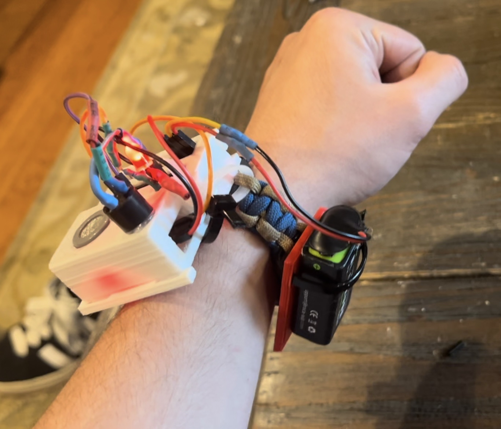
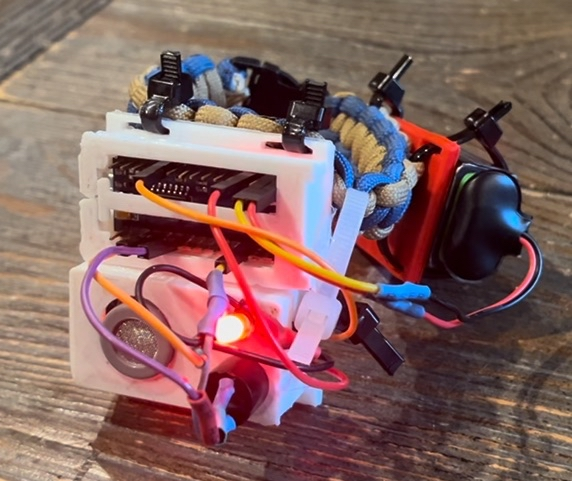
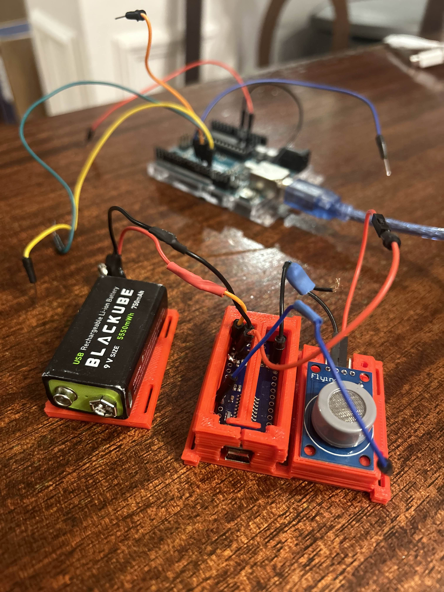
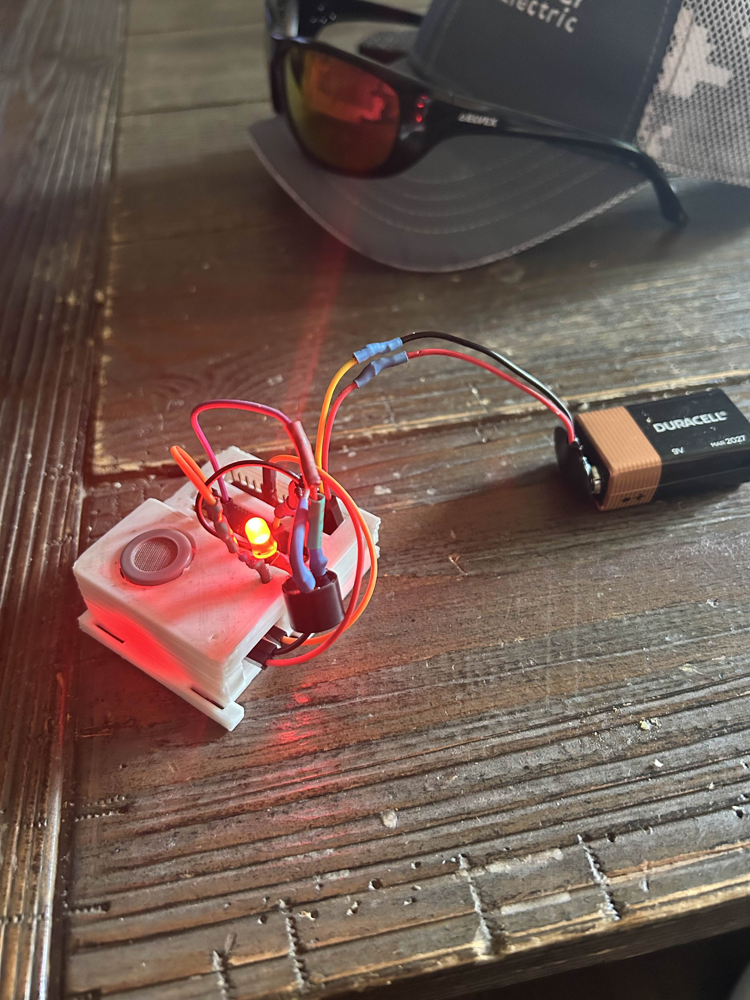
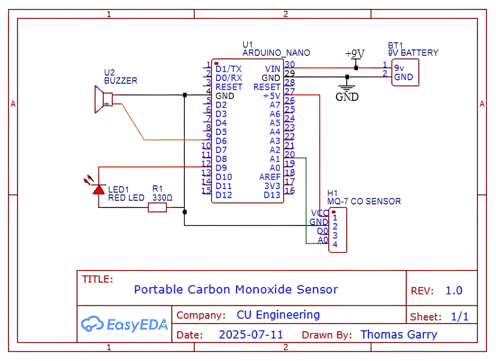
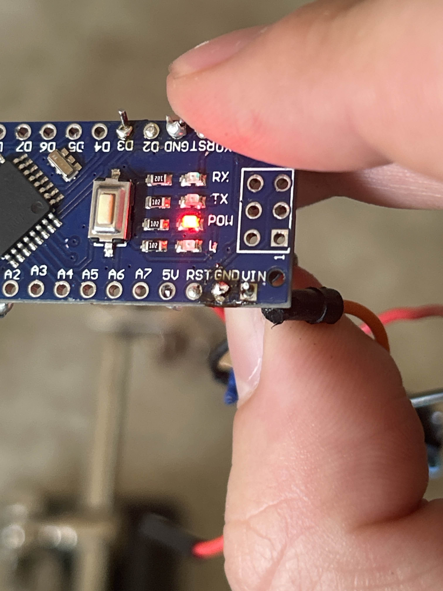

# wearable-low-cost-CO-alarm
<table>
  <tr>
    <td align="center">
      <br>
      <em>The finalized prototype being worn</em>
    </td>
    <td align="center">
      <br>
    </td>
  </tr>
</table>

An Arduino-based carbon monoxide sensor designed for humanitarian aid and fire safety. Designed to be affordable, portable, and easily deployable in low resource environments.

## IMPORTANT:
This device was designed as an exercise in environmental monitoring and embedded systems, and SHOULD NOT BE USED FOR PERSONAL PROTECTION AS-IS. This is a prototype and needs serious revision and improvement to be considered robust life-saving tech. Additionally, CO concentration is NOT MEASURED IN PPM. Instead, it is measured by a relative value decided by the MQ-7's electrical resistance. As CO concentration increases, electrical resistance decreases in the detection element, outputting a higher value. While it still responds to generally dangerous levels of CO, this lack of precision should be clearly noted.


## Overview
This project aims to provide a simple, wearable, and cost effective early warning system for Carbon Monoxide (CO) detection. CO concentration is read via an MQ-7 gas detection module and is subsequently mapped and interpreted by an arduino nano. It then estimates the danger of the surrounding environment and alerts the wearer accordingly via an LED and Active Buzzer. As CO concentration increases, the LED begins to flash more rapidly. Should the concentration begin to pose serious harm to the wearer, the active buzzer begins playing a shrill tone. The frequency of both the LED and the Buzzer continue to increase as concentration continues.

## Images and Demonstrations
<table>
  <tr>
    <td align="center">
      <br>
      <em>Early sensor testing and experimentation</em>
    </td>
    <td align="center">
      <br>
      <em>Fitting components into test housing</em>
    </td>
    <td align="center">
      <br>
      <em>Final prototype with completed housing</em>
    </td>
  </tr>
</table>

### [Click here to watch the demo video](https://youtu.be/ickqqJnBo1I)

## Features
- Much lower cost of production than commercialf alternatives
- Highly portable, allowing for mobile detection across different rooms
- Entirely open-sourced, allowing for improvement and modification of all design aspects
- Easily understandable alerts and warnings based on relative CO concentrations
- Potential for mass production and distribution for humanitarian relief (if improved)

## Cost of development VS. commercial CO detectors
| Device | Price per Unit | Precision | Notes |
|--------|----------------|-----------|-------|
| [Standard Wall Mount Detector](https://garrytho.short.gy/nCqUUw) | ~$21.51 | Mid–High | Not portable. Requires constant power supply. |
| [Mid-Grade Pendant Detector](https://garrytho.short.gy/GrB9Nx) | ~$39.99 | High | Portable and compact for a moderate price point. Cannot be worn on the wrist. |
| [Professional-Grade Wristwatch Detector](https://garrytho.short.gy/PyZcWw) | ~$191.10 | Extremely High | Very portable and effective, but also very pricey. |
| **This Low-Cost CO Alarm** | **~$3.69** | Mid | Highly portable, easy and cheap to produce, but low precision. Strong applications in low-resource environments. |

## Use Cases and Applications
- **Humanitarian / Resource-Limited Settings:**  
  This device could be deployed in regions with limited electrical infrastructure, where generators are commonly used to power homes and appliances. Such setups frequently produce dangerous levels of CO, especially in enclosed spaces. Traditional detectors often require continuous power or stable mounting, which may be unavailable in these areas. This wrist-mounted detector can be mass-produced and distributed affordably, providing a basic but effective early warning system where no protection currently exists. While not a substitute for certified detectors, it offers a meaningful safety upgrade in underserved communities.

- **Fire Departments and Site Assessment Crews:**  
  While on-duty firefighters typically use advanced breathing gear, post-fire inspection teams, volunteers, or underfunded departments may not have access to the same equipment. This device can serve as a low-cost supplementary tool to alert users when entering environments with lingering CO buildup — a common byproduct of incomplete combustion. It's especially useful in apartment buildings, trailers, and other enclosed or multi-level spaces where CO can concentrate after a fire. In such scenarios, a wearable alert system provides added awareness when more advanced gear isn’t available.

- **Natural Disaster Response:**  
  In the wake of hurricanes, earthquakes, and other disasters, many affected areas lose power for extended periods. Relief efforts often provide generators and portable stoves to support temporary shelters, which can inadvertently introduce CO risk. Confined environments like tents or trailers are particularly vulnerable. This detector could be included in emergency kits as a low-cost safeguard, offering early warning in situations where commercial detectors are too expensive or logistically impractical. While not medical- or rescue-grade equipment, it can still help prevent tragedy in high-risk, off-grid environments.


## Bill Of Materials
| Component       | Description        | Quantity | Notes                                                 | Price (USD) | Link |
| --------------- | ------------------ | -------- | ----------------------------------------------------- | ------------ | ---- |
| Arduino Nano    | Microcontroller    | 1        | Any clone board will work. ATMega328p chip.           | ~$0.99       | [Buy](https://garrytho.short.gy/Aliexpress-Nano-Clone) |
| MQ-7 Gas Sensor | CO Detection       | 1        | 4 pin analog/digital version. Module brand is "Flying Fish" | ~$0.87   | [Buy](https://garrytho.short.gy/Aliexpress-MQ7) |
| 9V Battery      | Power Supply       | 1        | Generic will work, but rechargeable recommended        | ~$0.99       | [Buy](https://garrytho.short.gy/Aliexpress-rechargable-9v) |
| Resistor        | 330Ω               | 1        | N/A                                                    | ~$0.10       | [Buy](https://garrytho.short.gy/Digikey-330resistor) |
| Red LED         | Visual Indicator   | 1        | N/A                                                    | ~$0.18       | [Buy](https://garrytho.short.gy/Digikey-330resistor) |
| Active Buzzer   | Audio Indicator    | 1        | 5V variant                                             | ~$0.54       | [Buy](https://garrytho.short.gy/Digikey-5v-buzzer) |
### Total cost to develop: **~$3.67**
**(Note: You will also a wristband and a method of securing the housing. This is up to you. I used a paracord band and zip-ties.)** 

## Circuit Diagram



## Firmware Overview
The Arduino sketch is written in C, and uses analog values from the MQ7 sensor to dynamically alert the wearer as CO exposure increases. The urgency of the warning is determined by the frequency of the Buzzer and LED alert systems, which increase with CO value. 

### Pin Assignments
- **VIN** - +9V from 9V Battery
- **GND** - GND from 9V Battery
- **A1** - Analog output from MQ7 Sensor's A0 pin
- **+5V** - MQ7's VCC Pin
- **6** - Digital pin for Buzzer from Nano
- **9** - Digital pin for LED from Nano
- **GND(alt)** - GND line for each peripheral. LED, Buzzer, MQ7

### Setup Instructions
- Assemble the circuit as described above
- Connect the Arduino board to your computer via USB
- Open the provided .ino file in the Arduino IDE
- Select the appropriate port and board type (Nano)
- Upload the code to the Nano
- Disconnect from USB and power via 9V

### Behavior table
| Sensor Value Range | LED Blink Rate     | Buzzer Behavior     |
|--------------------|--------------------|---------------------|
| 0–300              | Slow Blink         | Off                 |
| 300–500            | Medium-fast blink rate  | Off                 |
| 500–700 (Danger)   | Fast blink         | Short buzz pulses   |
| 700-900 (Very Dangerous) | Rapid blink        | Rapid tone     |
| >900 (Fatal)       | Fastest blink rate | Fastest tone pulses | 

### Code Snippet
This logic allows the device to monitor CO levels from the MQ-7 sensor and control warning outputs accordingly:
```cpp
int CO = analogRead(A1);
int wait = 100;
if(CO < 900){
  wait = map(CO, 100, 900, 2000, 100); // Scale urgency
}

if(CO > dangerThreshold && gracePeriod == 0){
  toggleBuzzer();
}
toggleLed();
delay(wait);
```
For the full firmware, see [COAlarm.ino](COAlarm.ino)

## Development process and challenges
### Initial Vision: 
This project started as an exploration in building a wearable, low-cost CO detector using basic components. The goal was accessibility and a low cost of production — but this focus led to significant constraints regarding battery life, size of the device, and solidifying electrical connections with limited space

### Power Struggles
Early attempts with 3.7V LiPo batteries failed due to undervoltage or dead cells. A 9V battery was used for simplicity, but had poor battery life and bulky form factor. This power source is usable for this prototype, but would need to be switched to a more power-conscious component in future iterations. Additionally, proper power cycling and lower voltage components would be leveraged for greatly increased battery life. 

### Wiring & Hardware
A limited amount of GND pins in this development board required creative wiring to connect all peripherals. The first GND (located next to VIN) pin was reserved for the power supply, leaving only one GND pin to ground everything else within the circuit. To combat this, a three way splice was utilized to spread pin access across the device. However, this connection proved tricky to solder, and required much trial and error to be made securely. Such issues underscore the fragility of developing with a breadboard style board like an Arduino Nano. A PCB board would drastically improve reliability and size, and would certainly be utilized in future iterations of this project.
<p align="center">
  <br>
  <em>Figure: A fried ground pin resulting from too many soldering attempts. Resulted in a bricked board.</em>
</p>


### Firmware Logic
Initial firmware simply toggled alerts at a fixed threshold, but this felt too simplistic. The final version maps analog readings to variable blink and tone rates for more intuitive, graduated feedback. Debugging involved monitoring sensor values over serial and tuning thresholds manually.

### Startup Errors
Due to the nature of the MQ-7 sensor, accurate readings cannot be provided until a heating module powers up. As such, changes to the firmware were made to allow a "grace period" of ten readings in which the sensor is allowed to calibrate without triggering a warning. 

### Hardware Limitations & Planned Improvements
| Issue                    | Description                                              | Planned Fix                                                                 |
|--------------------------|----------------------------------------------------------|------------------------------------------------------------------------------|
| Battery reliability      | 9V battery is bulky with poor lifespan                  | Replace with coin cell or compact rechargeable battery + low-power components |
| Unstable wiring          | Spliced joints and daisy-chained grounds are fragile    | Use custom PCB for stable, consistent connections                            |
| Sensor limitations       | MQ-7 has high power draw and long warm-up time          | Swap for electrochemical sensor to reduce power use and increase responsiveness |
| Noisy / unreliable data  | Analog readings fluctuate between runs                  | Use more accurate sensor to reduce data noise                                |
| Bulkiness                | Device is wearable but still awkward in form            | Optimize PCB layout and components for slimmer, wrist-friendly design        |


